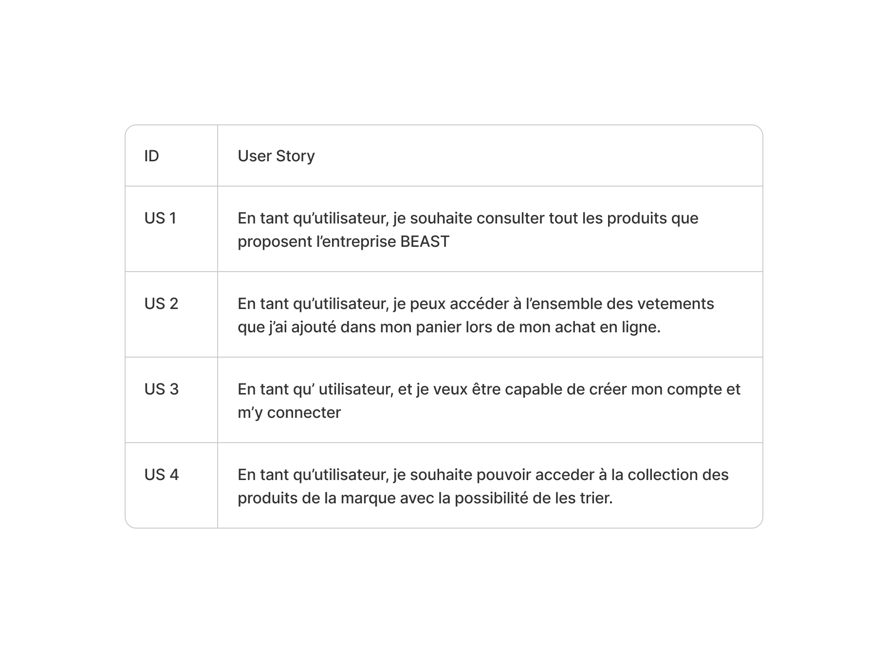
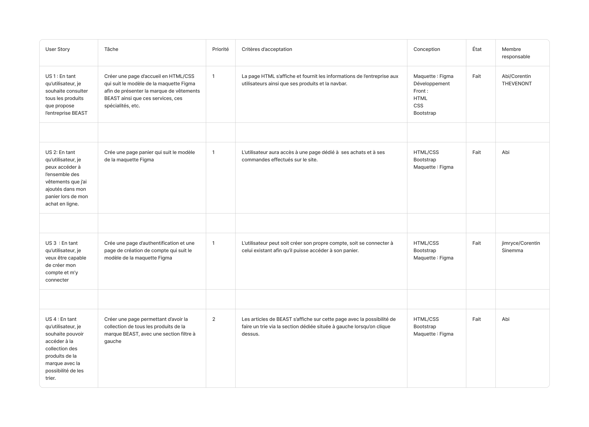
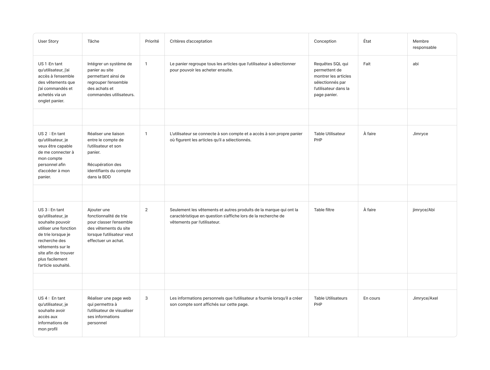
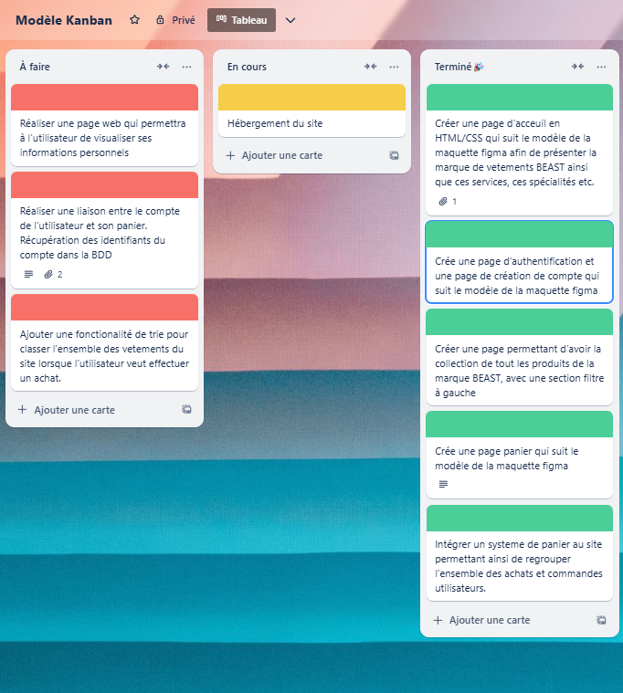

# **BEAST**

## **Membres** 

- Abi Vigneswaran
- Jimryce Jouenne
- Corentin Sinnema
- Axel Friboulet
- Corentin Thevenot 

### **Description** 

* Le projet de BEAST est un site web de type e-commerce. Plus précisément, de la vente de vêtement conçu dans le domaine de la  
  randonnée et du bivouac. Il s’agit d’un site permettant d’accéder à divers vêtements de la marque de vêtements, et ainsi, effectuer des achats en cas d’un ou de plusieurs produits un intéressé. La marque souhaite cibler principalement les amoureux de la randonnée. 

 
#### **Conduite de projet**

#### **Méthode utilisée : Scrum**

* La méthode utilisée durant ce projet était la méthode SCRUM.

  Pourquoi avons-nous utilisé la méthode SCRUM ? Pour plusieurs raisons : 
 
    - Une meilleure compréhension de l'avancement de nos tâches 
  
    - Une cohésion encore plus solide au sein de l’équipe, grâce aussi aux retours de 
      chacun de nos tâches 

    - Une meilleure envie d’effectuer le travail et nos tâches grâce à la manière que nous pouvons nous organiser grâce à SCRUM
  
    - Elle nous permet de mieux comprendre ce qui peut ne pas être terminé et à réfléchir sur comment nous pouvons résoudre cela 
      pour finir le projet

* Notre projet s’est déroulé en 2 Sprint, nous avons commencé dès la première semaine à la réalisation de la partie front 
  du site E-Commerce à l’aide des langages de développements tels que le HTML, le CSS, mais aussi de la librairie Bootstrap.
  L’objectif était de faire la création de la page d'accueil, expositions des produits, leur description et enfin une page
  de design du panier. 

* Enfin, pour le second sprint, il fallait ne plus rendre le site statique avec le front. Ce second sprint a pour 
  objectif de créer la partie base de données et de le relier avec le front.

**SPRINT 1**
  **USER STORY 1**

  **BACKLOG SPRINT 1**

**SPRINT 2**

  **BACKLOG SPRINT 2**

#### **Répartition des tâches**

* Pour la répartition des tâches, après que nous avons trouvé nos sprint, nos users story et enfin la réalisation de nos 
  Backlog. Nous avons réalisé un Trello pour faire un Kanban afin qu’on puisse opérer une meilleure organisation et observer
  un meilleur avancement des tâches.

  

* Cependant, l’équipe a rencontré un problème, quelques jours après le déroulement du projet. Nous avons eu Axel Friboulet 
  le chef de projet, Corentin Thévenot et Corentin Sinnema, qui ont décidé d’abandonner le projet. 

* L’objectif d’un projet étant qu’il puisse arriver à sa fin, et qu’il réponde à un besoin, il était difficile pour les
  deux restants du groupe d’effectuer toutes les tâches du projet lorsque les membres du groupe sont absents. Les trois
  membres du groupe ont perdu de l'intérêt face au projet, il était difficile de leur donner des tâches pour que le 
  projet se concrétise. Le nombre de tâches à effectuer et le nombre de membres dans le groupe n’était pas en adéquation.

* De plus, Jimryce Jouenne manquait de temps pour la réalisation de ce projet. Étant en groupe dans divers projets avec
  Axel Friboulet, Corentin Thévenot et Corentin Sinemma et suite à leur abandon aux autres projets, Jimryce Jouenne 
  devait effectuer toutes les tâches des autres projets. Pour nous, il était judicieux de recommencer la répartition
  des tâches au sein de l’équipe et de se donner des rôles différents tels que le changement de rôle du chef de 
  projet, donné à Abi Vigneswaran. 

* La répartition des tâches au sein des membres reste tout de même déséquilibrée, suite aux problèmes rencontrés avec les abandons et 
  les disponibilités. 

**Voici les tâches à faire au sein du groupe pour le sprint 1 :** 

**Chef de projet, Designer UI/UX & Développeur Front : Vigneswaran Abi**

    - Concevoir la maquette de la page d’accueil et développer en HTML/CSS 
  
    - Concevoir la maquette de la page panier et le développer en HTML/CSS
  
    - Concevoir la maquette de la page collection et le développer en HTML/CSS

**Développeur Back : Corentin Thevenot**

    - Développer la page d'accueil en HTML/CSS 

**Designer UI/UX : Corentin Sinnema**

    - Création de la maquette de la page d’authentification

**Développeur Front : Jimryce Jouenne**

    - Développement de la page d'authentification en HTML/CSS

**Testeur  : Axel Friboulet** 
 	  - Vérification des pages, de son interface utilisateur, son parcours
  
 	  - Vérification des fonctionnalités essentielles pour le fonctionnement d’un site e-commerce

**Bilan du sprint 1** : Les tâches ont été effectuées et nous avons pu opérer une bonne communication au sein du
  groupe. Chaque jour, nous avons pu discuter entre nous afin de connaître l’avancement du projet, et savoir si 
  chacun des membres rencontraient des problèmes, ce qu’il comptait faire ensuite. 

  De plus, nous avons pu anticiper quelques problèmes, ayant confié la tâche responsable à Corentin Thévenot de 
  coder la page d’accueil, notre membre étant en manque de matériel pour développer le site, ce dernier développe
  sur son téléphone, il ne peut pas observer le rendu du site sur son téléphone. Il était probable pour nous que
  son code ne ressemblera pas à la maquette Figma, il était donc à Abi Vigneswaran de développer la page d'accueil 
  lui-même. 

**Voici les tâches à faire au sein du groupe pour le sprint 2 :**

**Chef de projet, Designer UI/UX & Développeur Front : Vigneswaran Abi**

    - Intégrer un système de panier au site avec une BDD et en PHP
  
    - Ajouter une fonctionnalité de tri pour classer l’ensemble des vêtements du site lorsque
      l’utilisateur veut effectuer un achat.

**Développeur Front : Jimryce Jouenne**

    - Réaliser une liaison entre le compte de l’utilisateur et son panier, récupération des 
      identifiants du compte dans la BDD

    - Ajouter une fonctionnalité de trie pour classer l’ensemble des vêtements du site lorsque l’utilisateur
      veut effectuer un achat avec une BDD et en PHP

    - Réaliser une page web qui permettra à l’utilisateur de visualiser ses 
      informations personnelles

**Développeur Back : Axel Friboulet** 

    - Réaliser la BDD du compte utilisateur

**Bilan du sprint 2 :** Toutes les tâches n’ont pas été réalisées. Avec l’abandon de Corentin Sinnema, de Thévenot, 
  il était difficile de les solliciter pour que nous puissions leur contribuer des tâches afin que nous finalisions 
  le projet. Nous avons pu réaliser le système du panier, mais aussi que les utilisateurs puissent se connecter. 

  Cependant, nous n'avons pas réussi à effectuer la liaison entre les utilisateurs et le système du panier. Les tâches
  qui devaient être effectuées ont pris pas mal de temps que prévu, malgré nos échanges constants entre les membres
  restantes, nous avons dû nous arrêter avec seulement la création du système panier, de la création et la connexion 
  de l'utilisateur. 

**Ce qu’on aurait pu faire pour réussir le sprint 2 :** 
    - En vue du temps et du nombre de membres du groupe, il aurait peut-être judicieux de créer un site uniquement static,
      sans de partie back
      
    - Adopter une meilleure anticipation des départs des membres pour permettre de refaire les - tâches en fonction
      de leur priorité et éviter un retard
      
    - Prioriser avant tout la liaison avec le panier et l’utilisateur dès son départ, plutôt que de le réaliser le panier 
      et l’utilisateur séparément

**Conclusion :**
  Des erreurs ont été commises lors du sprint 2 suite à des tâches qui ne sont pas terminées. Cela nous fait prendre
  conscience qu’il serait important pour les projets futurs d’adopter une meilleure anticipation et une meilleure 
  priorisation des tâches. 

  Adopter une communication rapidement avant de commencer le projet pour savoir si chacun des membres ne risque pas 
  d’avoir des problèmes ou des envies de départ. Un projet qui n’a pas réussi à aboutir mais qui nous a permis 
  d'accroître en maturité sur la gestion d’un projet et notamment en équipe avec de réels enjeux auquel certains 
  membres ont fait face. 

#### **Étapes principales :**

1) **Idéation et conception**  
   
   Réflexion sur le fonctionnement des outils tels que le panier, le filtrage. 
   Inspiration des sites d'e-commerce célèbres : H&M, Zara… 
   Création des maquettes et prototypage avec des outils comme Figma.

2) **Développement des fonctionnalités principales**
   
   Développement de l’outil d’ajout de produit : À l’aide d’une base de données et du PHP, nous avons mis en place
   la fonctionnalité d’ajouter un produit et de l’ajouter à son panier, nous pouvons ajouter un grand nombre de 
   produits, mais nous pouvons aussi en supprimer. 

   Développement de l’outil de connexion et la création de compte : À l’aide d’une base de données et du PHP,
   nous avons réussi à mettre en place une page permettant à l’utilisateur de créer un compte avec ses informations
   personnelles, et ensuite de se connecter.

   Présentation des produits : Les produits de la marque de Beast sont présentés en détail à la page de collection, 
   permettant ainsi d’observer sa description, sa couleur, sa fabrication d’origine, sa matière ainsi que son prix	

3) **Tests et débogage**

   Lors de la réalisation du formulaire de connexion et création de compte, les membres du groupe ont testé sur
   leur machine que le code de la page fonctionnait comme prévu.

   Il en va de même pour le lien de la BDD avec les fichiers HTML.

4) **Hébergement**

   Suite à des problèmes rencontrés, nous n'avons pas pu mettre en place l’hébergement du site de BEAST, ayant 
   démarré les procédures pour l’hébergement, nous avons eu des soucis sur l’installation du logiciel FileZilla, 
   considéré comme potentiellement dangereux, Abi Vigneswaran n’était pas en mesure de continuer la suite de l’hébergement 
   sur Always Data
